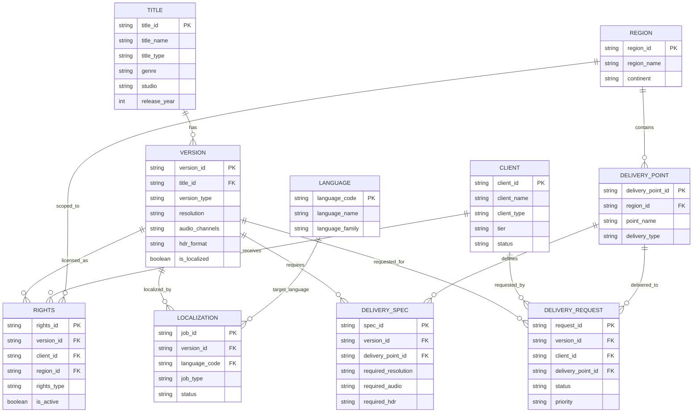
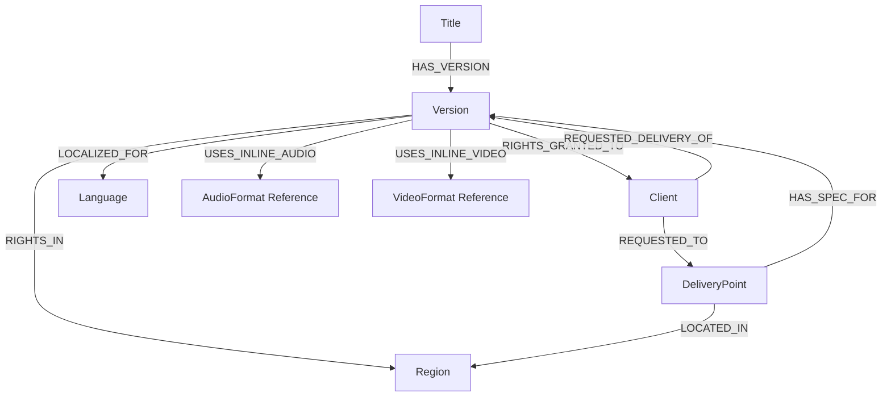

# KG Demo Data Model

This document summarizes the generated CSV dataset in this folder and the graph-oriented model it suggests for Neo4j.

## Dataset Overview

The current dataset contains the following CSV files and row counts:

| File | Rows | Role |
| --- | ---: | --- |
| `titles.csv` | 5,000 | Core content titles |
| `versions.csv` | 17,735 | Technical/content versions of titles |
| `clients.csv` | 200 | Studios, streamers, broadcasters, aggregators |
| `regions.csv` | 50 | Geographic regions or territories |
| `languages.csv` | 30 | Localization target languages |
| `delivery_points.csv` | 150 | Delivery destinations such as streaming, broadcast, theatrical, VOD |
| `rights.csv` | 53,082 | Rights grants linking versions, clients, and regions |
| `localization.csv` | 17,839 | Localization jobs for versions and languages |
| `delivery_specs.csv` | 612 | Format requirements by delivery point and version |
| `delivery_requests.csv` | 20,000 | Operational delivery requests |
| `audio_formats.csv` | 8 | Reference values for audio formats |
| `video_formats.csv` | 6 | Reference values for video formats |

At the CSV level, the model is a hybrid of:

- entity tables such as `titles`, `clients`, `regions`, and `languages`
- relationship/event tables such as `rights`, `localization`, `delivery_specs`, and `delivery_requests`
- reference tables such as `audio_formats` and `video_formats`

## Core Tables

### `titles.csv`

Represents the master content object.

Key fields:

| Column | Meaning |
| --- | --- |
| `title_id` | Primary identifier |
| `title_name` | Generated content name |
| `title_type` | `Movie`, `TV Series`, `Documentary`, `Special`, `Miniseries` |
| `genre` | High-level genre |
| `studio` | Studio/producer label |
| `release_year` | Release year |
| `duration_minutes` | Runtime |
| `season_count` | Relevant for serialized content |
| `created_at` | Record creation timestamp |

### `versions.csv`

Represents distinct technical or editorial versions of a title.

Key fields:

| Column | Meaning |
| --- | --- |
| `version_id` | Primary identifier |
| `title_id` | Foreign key to `titles.title_id` |
| `version_type` | `Original`, `Localized`, `Remastered`, `Edited` |
| `resolution` | Inline technical attribute |
| `frame_rate` | Inline technical attribute |
| `audio_channels` | Inline technical attribute |
| `hdr_format` | Inline technical attribute |
| `file_size_gb` | Approximate size |
| `is_localized` | Flag used to drive localization job creation |
| `created_date` | Version timestamp |

### `clients.csv`

Represents external business entities that receive rights or request deliveries.

Key fields:

| Column | Meaning |
| --- | --- |
| `client_id` | Primary identifier |
| `client_name` | Company name |
| `client_type` | Major Studio, Streaming Service, Broadcaster, Aggregator, Independent |
| `tier` | Tier 1 to Tier 3 |
| `region_focus` | Business focus area |
| `active_since` | Year client became active |
| `credit_limit_usd` | Commercial metadata |
| `status` | `Active` or `On Hold` |

### `regions.csv`

Represents geographic territories.

Key fields:

| Column | Meaning |
| --- | --- |
| `region_id` | Primary identifier |
| `region_name` | Territory/country-like label |
| `continent` | Region bucket |

### `languages.csv`

Represents localization targets.

Key fields:

| Column | Meaning |
| --- | --- |
| `language_code` | Primary identifier |
| `language_name` | Human-readable language name |
| `language_family` | Broad language family |

### `delivery_points.csv`

Represents operational destinations for content delivery.

Key fields:

| Column | Meaning |
| --- | --- |
| `delivery_point_id` | Primary identifier |
| `point_name` | Destination label |
| `delivery_type` | `Streaming`, `Broadcast`, `Theatrical`, `VOD`, `Physical` |
| `region_id` | Foreign key to `regions.region_id` |

## Relationship and Event Tables

### `rights.csv`

Encodes licensing rights for a `Version`, granted to a `Client`, scoped to a `Region`.

| Column | Meaning |
| --- | --- |
| `rights_id` | Primary identifier |
| `version_id` | Foreign key to `versions.version_id` |
| `client_id` | Foreign key to `clients.client_id` |
| `region_id` | Foreign key to `regions.region_id` |
| `rights_type` | Exclusive, Non-exclusive, Territorial, Windowed |
| `start_date` | Rights start timestamp |
| `end_date` | Rights end timestamp |
| `is_active` | Current active flag |
| `territorial_restrictions` | Restriction category |
| `exclusivity_window_days` | Optional duration metadata |

### `localization.csv`

Encodes localization work items for a `Version` and `Language`.

| Column | Meaning |
| --- | --- |
| `job_id` | Primary identifier |
| `version_id` | Foreign key to `versions.version_id` |
| `language_code` | Foreign key to `languages.language_code` |
| `job_type` | Dubbing, Subtitling, Voice-over, Audio Description |
| `status` | Delivery workflow status |
| `completion_date` | Present for completed jobs |
| `quality_score` | Optional QA outcome |
| `vendor` | Internal or external vendor |

### `delivery_specs.csv`

Defines destination-specific technical requirements for a `Version` at a `DeliveryPoint`.

| Column | Meaning |
| --- | --- |
| `spec_id` | Primary identifier |
| `delivery_point_id` | Foreign key to `delivery_points.delivery_point_id` |
| `version_id` | Foreign key to `versions.version_id` |
| `required_resolution` | Required video profile |
| `required_audio` | Required audio profile |
| `required_hdr` | Required HDR profile |
| `required_container` | Required packaging/container |
| `max_bitrate_mbps` | Bandwidth cap |
| `is_mandatory` | Requirement priority flag |

### `delivery_requests.csv`

Represents operational requests to deliver a `Version` for a `Client` to a `DeliveryPoint`.

| Column | Meaning |
| --- | --- |
| `request_id` | Primary identifier |
| `version_id` | Foreign key to `versions.version_id` |
| `client_id` | Foreign key to `clients.client_id` |
| `delivery_point_id` | Foreign key to `delivery_points.delivery_point_id` |
| `request_date` | Request creation timestamp |
| `deadline` | Delivery deadline |
| `status` | Pending, In Progress, Completed, Failed, Delayed |
| `actual_completion` | Actual fulfillment time if completed |
| `priority` | Operational urgency |
| `file_size_gb` | Payload size |

## Reference Tables

### `audio_formats.csv`

Contains a catalog of named audio formats such as `Stereo`, `5.1 Surround`, `7.1 Surround`, and `Dolby Atmos`.

### `video_formats.csv`

Contains a catalog of named video formats such as `HD`, `4K UHD`, `8K`, `HDR10`, `HDR10+`, and `Dolby Vision`.

Important note:

- these two tables are reference dictionaries only in the current dataset
- `versions.csv` and `delivery_specs.csv` store format values inline as strings instead of using `format_id` foreign keys
- if you want a cleaner graph or relational model, these can be normalized into explicit linked entities later

## CSV-Level Entity Relationship Diagram

## Suggested Neo4j Graph View

This dataset maps naturally to a graph where the master entities become nodes and the event tables become relationship-rich connectors.

### Recommended Graph Interpretation

If you load this into Neo4j, the cleanest node set is:

- `Title`
- `Version`
- `Client`
- `Region`
- `Language`
- `DeliveryPoint`
- optionally `AudioFormat` and `VideoFormat`

The relationship/event tables can be represented in two common ways:

1. As direct relationships with properties.

Examples:

- `(:Title)-[:HAS_VERSION]->(:Version)`
- `(:Version)-[:RIGHTS_GRANTED {rights_type, start_date, end_date, is_active, territorial_restrictions, exclusivity_window_days}]->(:Client)`
- `(:Version)-[:RIGHTS_REGION]->(:Region)`
- `(:Version)-[:LOCALIZATION_JOB {job_id, job_type, status, completion_date, quality_score, vendor}]->(:Language)`
- `(:DeliveryPoint)-[:DELIVERY_SPEC {spec_id, required_resolution, required_audio, required_hdr, required_container, max_bitrate_mbps, is_mandatory}]->(:Version)`
- `(:Client)-[:DELIVERY_REQUEST {request_id, request_date, deadline, status, actual_completion, priority, file_size_gb}]->(:Version)`

2. As explicit event nodes when you want better provenance and easier multi-hop analytics.

Examples:

- `RightsGrant`
- `LocalizationJob`
- `DeliverySpec`
- `DeliveryRequest`

This second option is often better for RAG demos because it makes process history and operational facts easier to query and explain.

## Key Modeling Observations

- `Title -> Version` is the central hierarchy.
- `Rights`, `Localization`, `DeliverySpec`, and `DeliveryRequest` are the main operational connectors.
- `DeliveryPoint -> Region` is the only direct location hierarchy in the current CSV model.
- `audio_formats.csv` and `video_formats.csv` are not yet normalized into foreign-key relationships.
- `delivery_requests.csv` is effectively a fact table tying together `Version`, `Client`, and `DeliveryPoint`.
- `rights.csv` is the strongest multi-hop table for region- and client-based access questions.
- the current generated `regions.continent` values appear to be one-character codes because the generator takes the first character of a chosen region bucket

## Example Question Paths Supported by the Model

- Which active clients have rights for a given title in a specific region?
  - `Title -> Version -> Rights -> Client` plus `Rights -> Region`
- Which versions still have pending localization work in a target language?
  - `Version -> Localization -> Language`
- Which delivery points in a region have mandatory specs for a version?
  - `Version -> DeliverySpec -> DeliveryPoint -> Region`
- Which delivery requests are failing for high-priority large files?
  - `DeliveryRequest -> Version`, `Client`, `DeliveryPoint`
